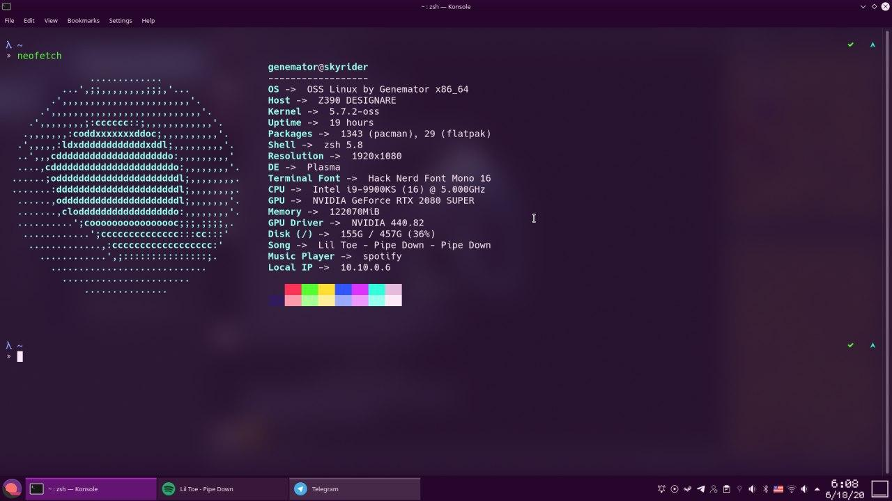

<h2 align="center">
  <br>
  
  <br>
OSS Linux Installer
</h2>

<h4 align="center">Install your OSS Linux more quickly</h4>


<p align="center">• 
  <a href="#feature">Feature</a> •
  <a href="#how-to-use">How To Use</a> •
  <a href="#errors-and-bugs">Errors and bugs</a> •
  <a href="#license">License</a> •
</p>



## Feature

- Pseudo interface, more friendly than pure command line.
- Support KDE, Xfce and Gnome desktop system installation.
- Support Gnome configuration
- Support sogou input method installation in Gnome.
- You can backup and restore configuration of application in Gnome.
- Support BIOS and UEFI boot mode
- Automatically detect Windows startup option

## How To Use

First, you need to prepare an Arch Linux LiveUSB and connect to the internet.

Use this Installer：

```bash
bash <(curl https://raw.githubusercontent.com/genemators/oss/master/install.sh)
```

## Errors and bugs

If something is not behaving intuitively, it is a bug and should be reported.
Report it here by creating an issue: https://github.com/genemators/oss/issues

## License

CC0 1.0 Universal

---
